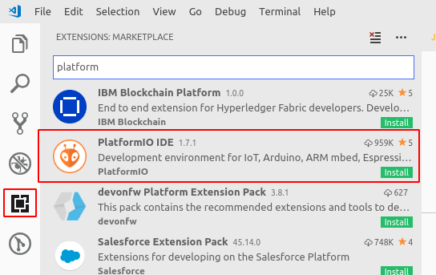

# NodeMCU Workshop

## Setup

Follow the steps outlined in this section to install the software necessary for the workshop.

### VSCode
__Visual Studio Code__ is a lightweight but powerful source code editor which runs on your desktop and is available for Windows, macOS and Linux.

It comes with support for a number of programming languages (C/C++ included), and is easy to set up and customize with extensions. In this workshop, we will use VSCode instead of the "standard" choice of Arduino IDE, as it offers a great extension [ihttps://platformio.org/](PlatformIO) (which will handle all our NodeMCU library setup and installation needs).

You can install VSCode by downloading the appropriate version for your system from [https://code.visualstudio.com/](the official link).

### PlatformIO

__PlatformIO__ is an open source cross-platform ecosystem for IoT development, featuring an IDE, a unified debugger, remote unit testing and firmware updates. It supports over 600 embedded boards (ESP8266 included), without external dependencies to a system software. It is available as an extension to _VSCode_ and _Atom_, offering easy adaptability and high customizability.

#### Why PlatformIO

It is possible to write code for ESP8266 (NodeMCU) in a standard Arduino IDE. However, using PlatformIO saves us the hassle of having to manually install different libraries and drivers required for the board, allowing us to be set up as soon as possible. 

Moreover, PlatformIO is a fully-featured IDE, offering numerous other functionalities lacking in Arduino IDE, such as code completion and linting, debugging, testing and much more.

_Installation_: 
    1. After installing VSCode, navigate to the `Extensions` tab on the left side of the IDE (or use the shortcut `Ctrl+Shift+X`), and search for "PlatformIO"
    

