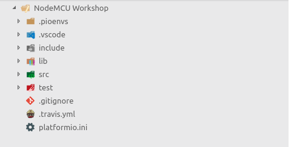

# NodeMCU Workshop

## NodeMCU & ESP8266

__NodeMCU__ is a popular and inexpensive development board, based on the widely explored __ESP8266__ microcontroller unit by _Espressif_. It offers WiFi networking capabilities (enabling it to be used as an access point, station or a Web server), Arduino-like hardware I/O,  as well as a myriad other stand-alone features, allowing it to form an excellent basis for an IoT platform.
  
As an open-source, full development board centered around ESP8266, NodeMCU includes an additional USB to Serial UART adapter, a micro-USB programming port and a 3.3V regulator, making it easy to connect to your computer, install the necessary drivers and begin developement.

Read more about NodeMCU and ESP8266 on the [following link](http://42bots.com/esp8266/nodemcu-esp8266-iot-development-board-overview/).
  
## Project Setup

Follow the steps outlined in this section to install the software necessary for the workshop.

### VSCode
__Visual Studio Code__ is a lightweight but powerful source code editor which runs on your desktop and is available for Windows, macOS and Linux.

It comes with support for a number of programming languages (C/C++ included), and is easy to set up and customize with extensions. In this workshop, we will use VSCode instead of the "standard" choice of Arduino IDE, as it offers a fantastic developemnt extension [PlatformIO](https://platformio.org/) (which will handle all our NodeMCU library setup and installation needs).

You can install VSCode by downloading the appropriate version for your system from [the official link](https://code.visualstudio.com/).


### PlatformIO

__PlatformIO__ is an open source cross-platform ecosystem for IoT development, featuring an IDE, a unified debugger, remote unit testing and firmware updates. It supports over 600 embedded boards (ESP8266 included), without external dependencies to a system software. It is available as an extension to _VSCode_ and _Atom_, offering easy adaptability and high customizability.

Read more about PlatformIO and all it has to offer in their [official home page](https://platformio.org).

#### Why PlatformIO?

It is possible to write code for ESP8266 (NodeMCU) in a standard Arduino IDE. However, using PlatformIO saves us the hassle of having to manually install different libraries and drivers required for the board, allowing us to be set up as soon as possible. Additionally, PlatformIO makes it easy to install and integrate new libraries as we further work on our project.

Moreover, PlatformIO is a fully-featured IDE, offering numerous other functionalities lacking in Arduino IDE, such as code completion and linting, debugging, testing and much more.

#### Installation
1. After installing VSCode, navigate to the `Extensions` tab on the left side of the IDE (or use the shortcut `Ctrl+Shift+X`), and search for "PlatformIO".


2. Once you press `Install`, wait for the process to be completed. Soon afterwards, the bottom window `Output` will open, informing you that "PlatformIO Core" is being installed. __Do not__ close this window and wait for the setup to finish. 
3. After the core is installed, you will be prompted to `Reload` the window. 


4. Once the IDE is restarted, you will be greeted by the PlatformIO home screen. You are now ready to create your first project.


#### Troubleshouting & Caveats

If you are using a Windows operating system, completing the aforementioned installation steps should be sufficient for your setup. However, if you run a GNU/Linux operating system, due to its nature (required permissions), an additional action is needed:

- Add the current user to the `dialout` group (group which controls tty - serial ports) by running: `sudo usermod -aG dialout $USER`
- Restart the system, or log out and then log back in
    - _note_: you can verify that your user has been successfully added by running `getent group dialout`

Folowing this step, you should be able to use the development board without issues.

## Creating a New Project with PlatformIO

With VSCode and PlatformIO installed and set up, you are ready to create your first IoT project.

### Creating a Project

1. Start Visual Studio Code, open the `PlatformIO` tab, and navigate to the `Home` page
2. On the PlatformIO Home, click on the `+ New Project`, and set the specifications for your new projects (name, board, framework, etc.)


1. Fill in the desired project name, select **NodeMCU** as the development board (depending on your NodeMCU module, select either version 0.9 or 1.0; you can check that on the back of your module), and select **Arduino** as the framework. You can also specify a custom project location, or use the default one (depending on your OS).
2. Click `Finish` and wait for PlatformIO to download the ESP8266 SDK and other required libraries, and create your project structure. If this is your first time creating a project, it will take some time to download all necessary files. Subsequent project creations should complete much faster.


5. After all necessary data is downloaded, your project will be set up and ready to use. One last thing you should do is navigate to the `platformio.ini` file in the project hierarchy, and set the parameter `monitor_speed` to **115200**. This is the preferred baud rate for NodeMCU.

```ini
; add this line to the bottom of platformio.ini
monitor_speed = 115200
```

### Project Structure

PlatformIO will have created several folders and files in the project hierarchy, which should look something like this:
 - *note*: if you are not seeing this hierarchy, it is possible your side bar is hidden. Try using the shortcut `Ctrl+B` to display it.



- `.pionenvs` and `.piolibdeps` will contain compiled project files, and other binary data. **Do not** directly modify any files here.

- `.vscode` is a VSCode environment folder, which contains IDE-related settings and properties. There is no need to modify it.

- `include` contains the project header files (`.h` extension), for our custom C/C++ files. 

- `lib` contains project-specific (private) libraries. This folder is intended for libraries we want to use **only** with the current project. PlatformIO also offers a global library installer from its sidebar, which makes any installed library available to all future projects (and saves it in a global PlatformIO directory, not `lib`)

- `src` is core the part of your project, where the `main.cpp` file is located. This file is the project's **entry point**, from which the project will be run when compiled.

  - If you have previous experience with Arduino, you will notice that the overall base structure is the same, with there being a `setup()` and a `loop()` function. The one additional thing is the `<Arduino.h>` header at the top which now has to be included, as we are dealing with `.cpp` files (not `.ino`), and we need to tell the C++ compiler to utilize Arduino-specific functionalities.

```cpp
#include <Arduino.h>

void setup() {
  // put your setup code here, to run once:
}

void loop() {
  // put your main code here, to run repeatedly:
}
```

- `test` directory serves for housing unit and project tests.

- `.gitignore` and `.travis.yml` serve as Git omission and project CI (continuous integration) files, respectively. They are, for the time being, irrelevant to the project itself.
- `platformio.ini` contains the project configuration file. Various options, such as the platform, board, library directories, baud rate, upload port, etc. can be set and configured from here. 
  - refer to the [platformio.ini page](https://docs.platformio.org/en/latest/projectconf.html) for additional details

```ini
[env:nodemcu]
platform = espressif8266
board = nodemcu
framework = arduino
monitor_speed = 115200
```

We have provded a brief overview of all key folders and files in the project structure. If you want additional details, many of the generated folders contain a `README` file, or file comments, which can supply you with additional information about the purpose of each segment.