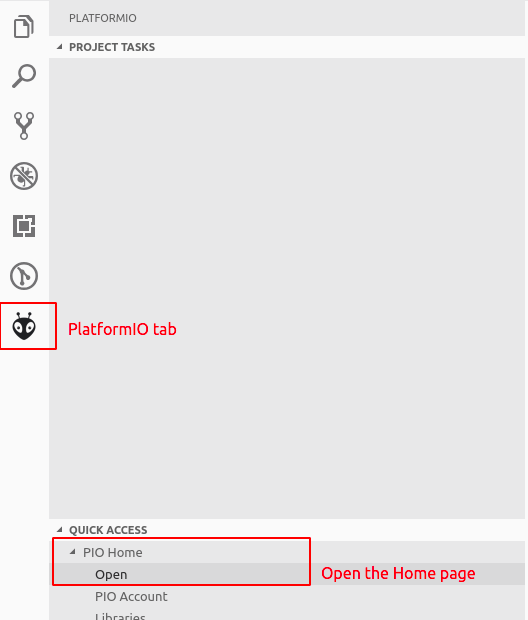

# Creating a New Project with PlatformIO

With VSCode and PlatformIO installed and set up, you are ready to create your first IoT project.

1. Start Visual Studio Code, open the `PlatformIO` tab, and navigate to the `Home` page

2. 